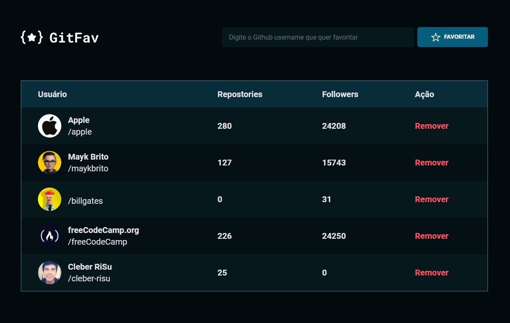

<h1 align="center">GitFav</h1>

  

## 🚀 Tecnologias

Esse projeto foi desenvolvido com as seguintes tecnologias:

- HTML
- CSS
- JavaScript

## 💻 Projeto

Um app para adicionar seus perfils de github favoitos.
Este projeto foi feito com o proposito de revisitar e praticar algumas práticas e funcionalidade do JS, acessando uma api e trabalhando com promisses.

---

Feito com ♥ by Cleber-Risu
